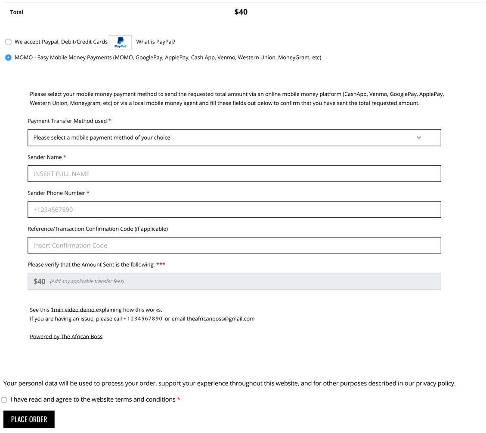
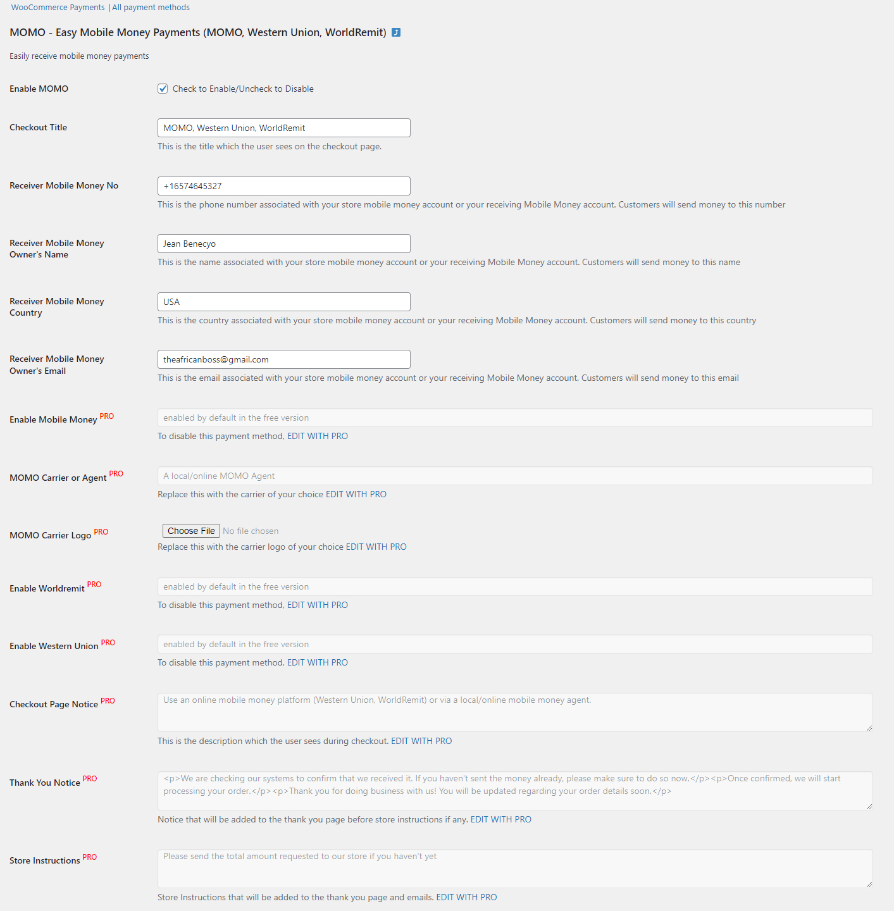
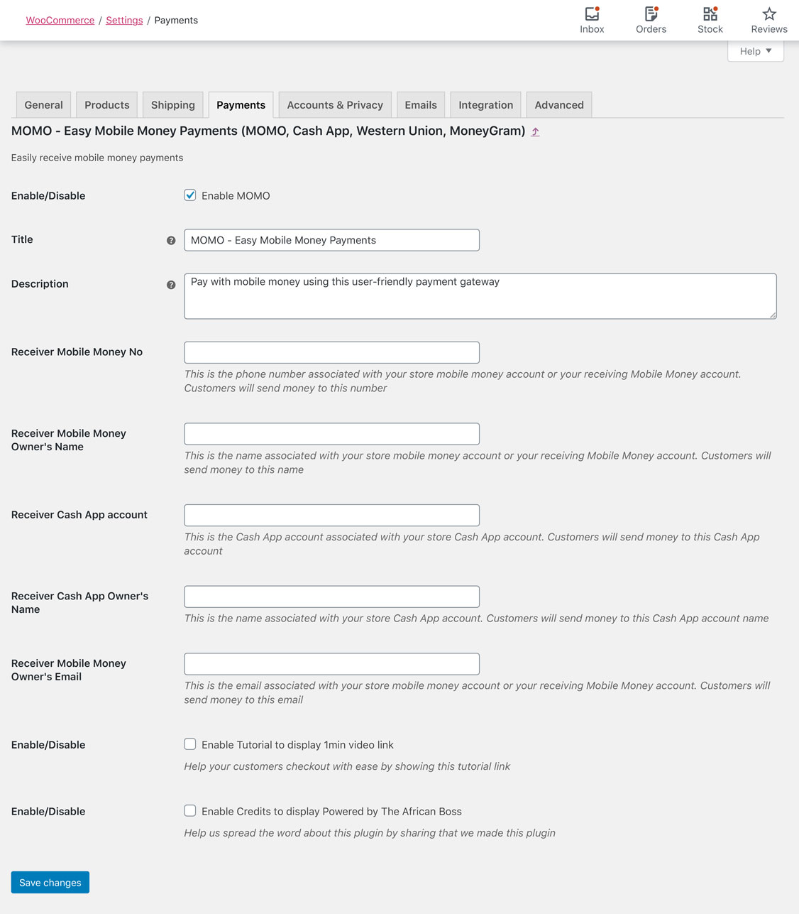

  

  <h3 align="center">MOMO - Mobile Money Payment Woocommerce Extension</h3>

  

    Receive mobile money payments from any country and carrier on your website with WooCommerce + MOMO (Use for MOMO, Cash App, Western Union, MoneyGram, WorldRemit)
     
    <a href="https://theafricanboss.com/momo"><strong>Learn More »</strong></a>
     
     
    <a href="https://theafricanboss.com/momo">View Demo</a>
    ·
    <a href="https://github.com/theafricanboss/woocommerce-momo/issues">Report Bug</a>
    ·
    <a href="https://github.com/theafricanboss/woocommerce-momo/issues">Request Feature</a>
  

## Description

Easy Mobile Money Payments via WooCommerce (MOMO, Cash App, Western Union, MoneyGram, WorldRemit)

For more details about this woocommerce extension, **please visit [The African Boss](https://theafricanboss.com/momo)**

See available screenshots or the store example of [Gura Stores](https://gurastores.com/test/) for visual details.

## Compatibility or Available Countries

This plugin is compatible with **any carrier in any country** since all it does is report details of a mobile money transaction between a customer and a store owner.

See the screenshots or the store example of [Gura Stores](https://gurastores.com/test/) for visual details.

## Demo

An example of the plugin in use is the following store:

[Gura Stores](https://gurastores.com/test/)

## Screenshots

- Checkout page

- Thank you page

- Plugin settings

## PRO or customized version

Please reach out to theafricanboss@gmail.com for a customized version of this plugin or for the pro version.

You may get upgrades of ‘MOMO - Mobile Money Payments Woocommerce Extension’ from [The African Boss](https://theafricanboss.com/momo)

Upgrades include **adding multiple numbers, different carriers, and more**

## Installation

### From Dashboard ( WordPress admin )

- Go to Plugins -> Add New
- Search for ‘MOMO - Mobile Money Payment Woocommerce Extension’
- Click on Install Now
- Activate the plugin through the “Plugins” menu in WordPress.

### Using cPanel or FTP

- Download ‘MOMO - Mobile Money Payment Woocommerce Extension’ from [The African Boss](https://theafricanboss.com/momo)
- Unzip ‘woocommerce-momo-extension.zip’ file and
- Upload ‘woocommerce-momo-extension folder to the “/wp-content/plugins/” directory.
- Activate the plugin through the “Plugins” menu in WordPress.

### After Plugin Activation

Find MOMO in your admin dashboard left sidebar menu of buttons

**or**

Go to Woocommerce-> Settings-> Payments screen to configure the plugin

Also _you can visit_ the [Official Documentation](https://github.com/theafricanboss/woocommerce-momo) page for further setup instructions.

## Frequently Asked Questions

### Does MOMO integrate Payment APIs?

MOMO plugin is a quick and easy way to notify the store owner that mobile money has been sent their way.
Unfortunately, it doesn't integrate any APIs and only notifies the store owner and the customer that the offline mobile money transaction took place.
Please check screenshots for more details on what is reported.

## Upgrade for more

You may get upgrades of ‘MOMO - Mobile Money Payment Woocommerce Extension’ from [The African Boss](https://theafricanboss.com/momo)

Upgrades include **adding multiple numbers, different carriers, and more**
